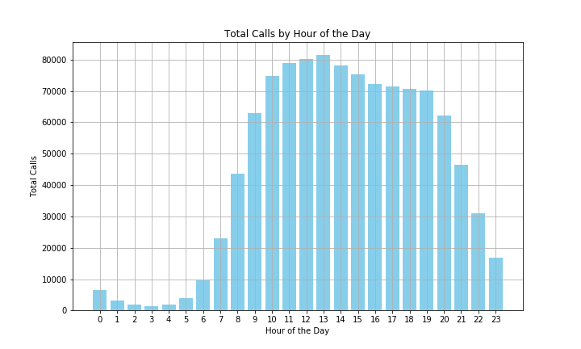

# Grandata Data Engineer Test
The objective of this test is to achieve 3 main tasks:

1. Calculate the total amount to be billed by the service provider for sending sms.
2. Generate a dataset containing the IDs of the 100 users with the highest SMS billing and the total amount to be billed to each one. Generate a dataset containing the IDs of the 100 users with the highest SMS billing and the total amount to be billed to each one. In addition to the ID, include the ID hashed using the MD5 algorithm. Write the dataset in parquet format with gzip compression.
gzip compression.

3. Plot a histogram of the number of calls made per hour of the day.

Technical requirements:
- Notebook: Zeppelin or Jupyter.
- Processing framework: Spark v2.3
- Programming languages: Scala 2.11 or Python 3.6
- Docker and Docker Compose
- README documentation

## Setting up the environment

Before launching the containers
```
docker run --name=master -d bde2020/spark-master:2.3.0-hadoop2.7

docker cp master:/spark spark

docker stop master
```

Then Launch docker compose
```
docker-compose up -d
```
## Technical Part - Exercise 1
Calculate the total amount to be billed by the service provider for sending sms.

Total billing is : 391367.0

## Technical Part - Exercise 2
Generate a dataset containing the IDs of the 100 users with the highest SMS billing and the total amount to be billed to each one. Generate a dataset containing the IDs of the 100 users with the highest SMS billing and the total amount to be billed to each one. In addition to the ID, include the ID hashed using the MD5 algorithm. Write the dataset in parquet format with gzip compression.
gzip compression.

[Dataset](top_100_bills.csv)

## Technical Part - Exercise 3
Plot a histogram of the number of calls made per hour of the day.



## General Questions - Exercise 1
Priorización de procesos
- Usar YARN para asignar colas con mayor prioridad a procesos productivos. Por ejemplo asignar un 70% de los recursos a producción y el restante 30% a los análisis exploratorios.
- Limitar el uso de CPU y memoria en los trabajos exploratorios para evitar interferir con los procesos productivos.

Estrategia de ejecución para procesos productivos

- Programar jobs pesados en horario no laboral
- Implementar escalado automático para ajustar los recursos según la carga.
- Dividir procesos grandes en trabajos más pequeños para distribuir la carga.

Herramientas de scheduling
YARN: Gestión de recursos con prioridades de colas.

## General Questions - Exercise 2
Las posibles causas del problema pueden llegar a ser:
- Tabla mal particionada/sin particionar.
- Falta de índices.
- Formato ineficiente.
- Ejecución de queries en paralelo.
- Existencia de small files.

Posibles soluciones:
- Verificar si existe la posibilidad de realizar el particionamiento de la tabla por criterios relevantes (fecha, región, etc.). Esto afectará ya que si uno quiere realizar un filtro, la query escaneará toda la tabla y luego filtrará, si existe una partición, se escanea solamente esta.
- Corroborar el formato en el que se están escribiendo los archivos, migrar a formatos especializados en datos, como por ejemplo PARQUET. Implementar también un esquema de compressión de archivos, como por ejemplo Snappy.
- Evitar realizar queries en paralelo hacia la misma tabla, ya que de esta manera se van a compartir los recursos dedicados.
- Evitar la existencia de small files siempre que se pueda, haciendo un agrupamiento de los mismos para tener la menor cantidad de archivos posibles, es más fácil escanear un archivo de 100 MB, que 10 archivos de 10 MB.
- Evaluar la posibilidad de crear vistas materializadas, esto para el caso en el que se ejecuten queries de manera repetida, ya que permitiría tener ya pre-cargados los datos, facilitando su acceso.

## General Questions - Exercise 3 
En primer lugar, se tendría que realizar el cálculo de la totalidad de los recursos disponibles:
- 150 GB de RAM
- 36 cores
Por lo tanto, nuestro proceso de Spark no debería consumir más de 75GB de RAM y 18 cores.
A partir de estos datos, podemos determinar lo siguiente:
```
spark.executor.instances = 6
spark.executor.memory = 10g
spark.executor.cores = 3
spark.driver.memory = 5g
spark.yarn.executor.memoryOverhead = 2g
spark.driver.memoryOverhead = 1g
spark.dynamicAllocation.enabled = false 
```
Esta última opción sirve para este caso en particular en donde no se quiere exceder del límite de recursos fijados, otro enfoque un poco más dinámico podría ser utilizando:
spark.dynamicAllocation.enabled = true y ajustar los parámetros de spark.dynamicAllocation.minExecutors y spark.dynamicAllocation.maxExecutors
Con esta configuración, lo que hacemos es permitir que Spark utilice hasta el 50% de los recursos, pero si necesita utilizar menos, lo hará. Con el caso en donde está asignada como false, se reservará el 50% del clúster, independientemente de los recursos que se estén utilizando.
Donde tendríamos que utilizar:

spark.dynamicAllocation.minExecutors = 3: Esto garantiza que Spark siempre tenga al menos 3 ejecutores disponibles.

spark.dynamicAllocation.maxExecutors = 6: Esto garantiza que no se utilicen más de 6 ejecutores.
